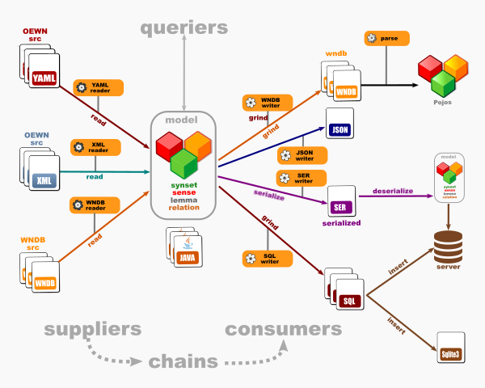

# Open English Wordnet toolkit

This project will group all toolkit repos that will provide suppliers and consumers of Open English Wordnet models.

## Dataflow

## Modules

Design is modular: modules do not depend on each other except model and chains. Each model is an independent archive
published on Maven Central.

**Model**

- [model](http://github.com/oewntk/model) : Model

**Suppliers**: YAML,XML,WNDB,serialized

- [fromyaml](http://github.com/oewntk/fromyaml) : Supply model from YAML
- [fromxml](http://github.com/oewntk/fromxml) : Supply model from XML
- [fromwndb](http://github.com/oewntk/fromwndb) : Supply model from WNDB
- [fromser](http://github.com/oewntk/fromser) : Supply model from serialized model

**Consumers**: WNDB,SQL,serialized

- [towndb](http://github.com/oewntk/towndb)  : Consume model to WNDB
- [tosql](http://github.com/oewntk/tosql) : Consume model to to SQL
- [toser](http://github.com/oewntk/toser) : Consume model to serialized model
- [tojson](http://github.com/oewntk/tojson) : Consume model to JSON

**Supplier-consumer chains**: YAML2SQL, YAML2WNDB, YAML2SER, XML2WNDB, WNDB2SER

- [grind_wndb2sql](http://github.com/oewntk/grind_wndb2sql) : Chain from WNDB supplier to SQL consumer
- [grind_wndb2json](http://github.com/oewntk/grind_wndb2json)  : Chain from WNDB supplier to JSON consumer
- [grind_wndb2wndb](http://github.com/oewntk/grind_wndb2wndb)  : Chain from WNDB supplier to WNDB consumer
- [grind_xml2wndb](http://github.com/oewntk/grind_xml2wndb)  : Chain from XML supplier to WNDB consumer
- [grind_yaml2ser](http://github.com/oewntk/grind_yaml2ser)  : Chain from YAML supplier to SER consumer
- [grind_yaml2sql](http://github.com/oewntk/grind_yaml2sql)  : Chain from YAML supplier to SQL consumer
- [grind_yaml2wndb](http://github.com/oewntk/grind_yaml2wndb)  : Chain from YAML supplier to WNDB consumer
- [grind_yaml2json](http://github.com/oewntk/grind_yaml2json)  : Chain from YAML supplier to JSON consumer

**Utils**

- [parse_wndb](http://github.com/oewntk/parse_wndb) : Parse WNDB data
- [jwi](http://github.com/oewntk/jwi) : Java WordNet Interface
- [jwiuse](http://github.com/oewntk/jwiuse) : Java WordNet Interface, API layer
- [jwix](http://github.com/oewntk/jwix) : Java WordNet Extended Interface
- [jwixuse](http://github.com/oewntk/jwixuse) : Java WordNet Extended Interface, API layer

## Data

* OEWN data in [WNDB](http://github.com/x-englishwordnet/wndb/) format
* OEWN data in [JSON](http://github.com/x-englishwordnet/json) format
* OEWN data in [Sqlite3](http://github.com/x-englishwordnet/sqlite) format
* OEWN data in [MySQL](http://github.com/x-englishwordnet/mysql) format
